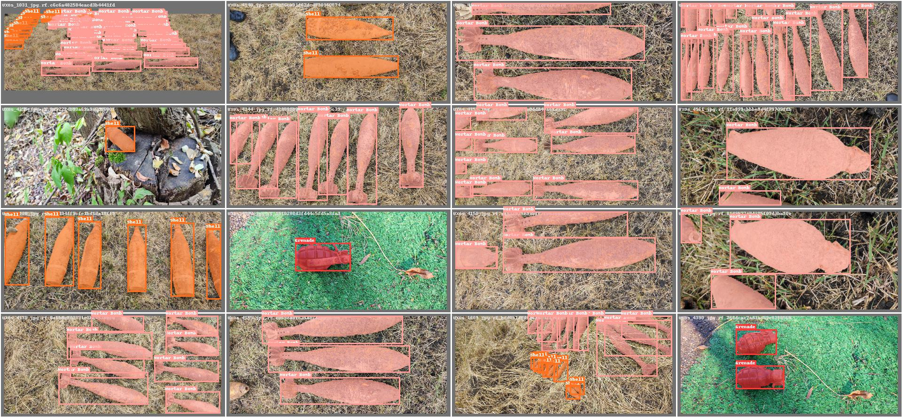

# CTX-UXO: A Comprehensive Dataset for Detection and Identification of UneXploded Ordnances


## Description
According to US NOAA, unexploded ordnances (UXO) are “explosive weapons such as bombs, bullets, shells, grenades, mines, etc. that did not explode when they were employed and still pose a risk of detonation”. UXOs are among the most dangerous threats to human life, environment and wildlife protection as well as to economic development. The risks associated with UXOs do not discriminate based on age, gender, or occupation, posing a danger to anyone unfortunate enough to encounter them. Contrary to expectations, an UXO is more hazardous than new ordnance, as its arming or initiation mechanisms may be active or compromised. A mistake in correctly identifying ordnance can be fatal, which is why a decision support system can assist in making decisions under continuous stress, where lives are at risk. Recent advances in image processing techniques and deep learning demonstrate that object detection and identification can be applied across multiple domains. However, until now, UXO detection has been limited by the lack of a representative, comprehensive dataset that provides robustness across different scenarios. UXOs are often found in altered, oxidized, semi-buried states in hard-to-reach environments.

We thus propose the Contextual Vision for Unexploded Ordnances (CTX-UXO) dataset, which provides a collection of labeled UXO images in various visual contexts within the visible spectrum. The dataset encompasses ammunitions in different stages, across multiple environments, angles, distances, and with various types of cameras.
Additionally, replicas of munitions, faithfully replicating the characteristics of real ordnance, were used to diversify the dataset by relocating or arranging them in new positions and environments, and by removing certain ordnance components. This approach aims to create a dataset that is as varied and representative of real-world scenarios as possible. The dataset will be periodically updated with new types of UXO in different visual contexts.

We hope that this dataset represents a useful resource for researchers and engineers working on supervised and semi-supervised object recognition projects, with particular emphasis on civil protection and emergency situation management applications.

The CTX-UXO dataset has been rigorously validated using a wide range of deep learning architectures and methodological frameworks, incorporating diverse preprocessing techniques. The resulting findings have been disseminated through peer-reviewed scientific publications:

```bibtex
@article{craioveanu2025ensemble,
  author    = {Craioveanu, M. and Stamatescu, G. and Popescu, D.},
  title     = {Ensemble Strategy with Multi-Step Hard Sample Mining for Improved UXO Localisation and Classification},
  journal   = {IEEE Access},
  volume    = {13},
  pages     = {123546--123558},
  year      = {2025},
  publisher = {IEEE}
}

@inproceedings{craioveanu2024detection,
  author    = {Craioveanu, M. and Stamatescu, G.},
  title     = {Detection and Identification of Unexploded Ordnance using a Two-Step Deep Learning Methodology},
  booktitle = {Proceedings of the 32nd Mediterranean Conference on Control and Automation (MED)},
  year      = {2024},
  address   = {Chania, Greece},
  month     = {June 11--14}
}

@inproceedings{craioveanu2025evaluation,
  author    = {Craioveanu, M. and Stamatescu, G.},
  title     = {Evaluation of the Robustness-Runtime Efficiency Trade-Off of Edge AI Models in UXO Localisation and Classification},
  booktitle = {Proceedings of the 33rd Mediterranean Conference on Control and Automation (MED)},
  year      = {2025},
  address   = {Tangier, Morocco},
  month     = {June 10--13}
}
```

We would like to thank the personnel of the National Romanian Inspectorate for Emergency Situations for their logistical support in the collection and dissemination of this dataset.

## Instructions
The dataset includes overall 15 449 instances in 3520 images, 4.38 instances/images, images groupen into 3 folders (train, validation, test). The images are formated as jpg files with a median image ratio 2124 px square and RGB color space. The images were captured using various devices, predominantly mobile phones with high-performance cameras. The most frequently used camera was a 64MP model equipped with the Samsung GW3 sensor (S5KGW3). This sensor is a 1/1.97" imager with 0.7µm pixels and employs Tetra-cell technology to enhance image quality. It is paired with a 25mm f/1.8 lens. 

Both YOLO and COCO annotation formats are supported. The dataset is structured into multiple repositories, each adapted for specific computer vision tasks such as binary classification, multi-class detection or instance segmentation. Future releases will include additional UXO types captured under varied environmental and lighting conditions. 

The first repository includes unannotated images, divided into the same three subsets, with the data split performed using the Multilabel Stratified Shuffle Split algorithm to maintain class balance. The distribution follows a 70% training portion, with 15% allocated to both validation and test sets. 

For binary detection and classification, 15 449 instances can be utilized (UXO/NON-UXO). Moreover, classification into specific classes (Mortar Bomb, Projectile, Grenade, Aviation Bomb, RPG, LandMine, Rockets, AntiSubmarine, Cartridge, Fuse) is feasible by labeling the data accordingly: 6 121 instances of projectiles, 4 269 instances of mortar bombs, 3 399 instances of grenades, 987 Cartridge, 333 Aviation Bombs, 124 Cartridge Magazine, 92 Fuses, 63 rocket-propelled grenades, 29 Landmines, 21 rockets, 6 antisubmarine, 5 sea mine. Instances can appear individually or within the same images, ensuring high diversity.

## Manual Download Links:
- [Zenodo](https://zenodo.org/records/17052675)
- [DataPort](https://ieee-dataport.org/documents/ctx-uxo-comprehensive-dataset-detection-and-identification-unexploded-ordnances)
- [Hugging Face](https://huggingface.co/datasets/UXO-Politehnica-Bucharest/Contextual_Vision_for_Unexploded_Ordnances) 
